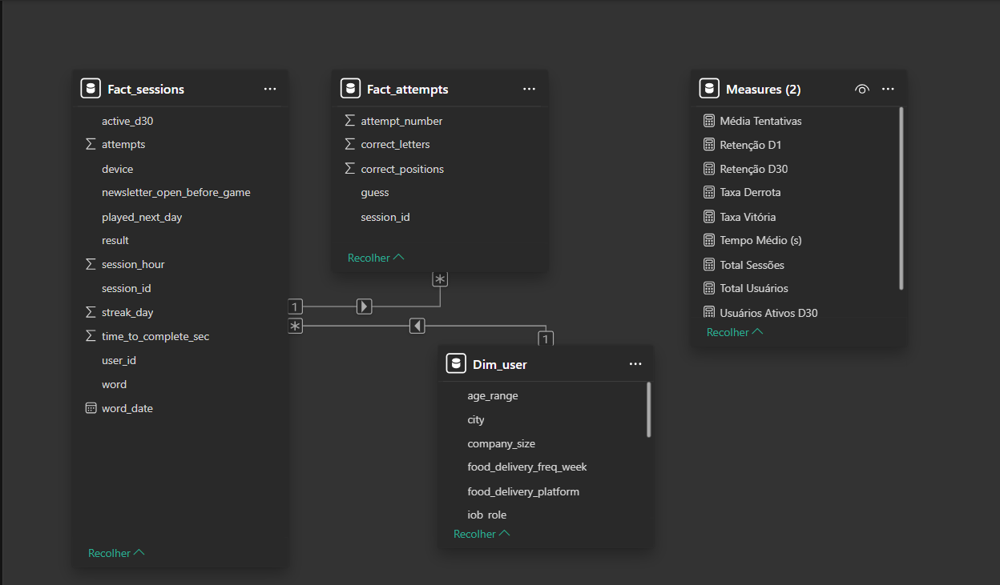
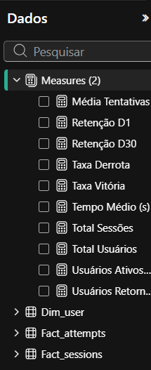
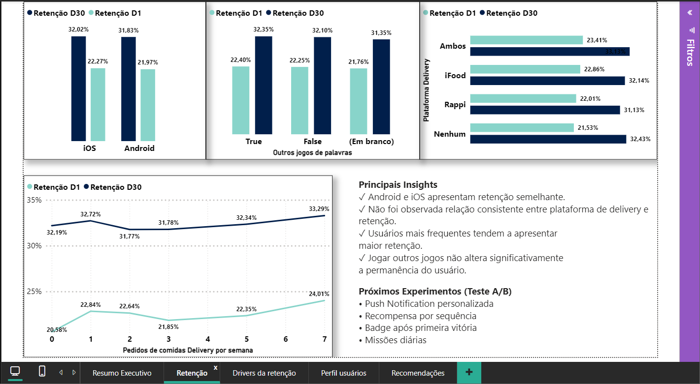
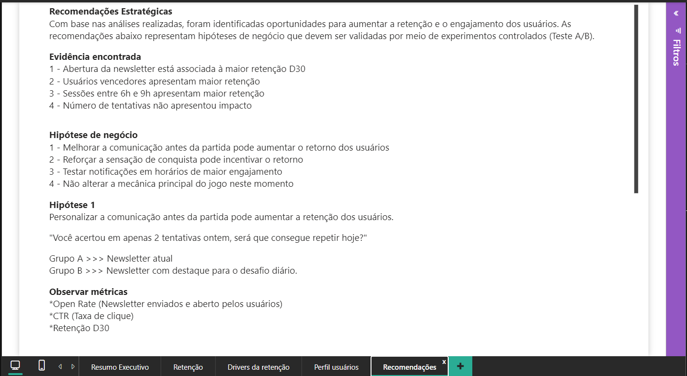

# 📊 Product Analytics | Retention Analysis - Palavritas (The News)

# ⚠️ Observação

Os arquivos CSV utilizados neste projeto pertencem ao case técnico disponibilizado pela empresa durante o processo seletivo e, por esse motivo, não foram publicados neste repositório.

# 📊 Como abrir o projeto no Power BI

Este repositório contém o arquivo "Palavritas_Result.pbix" desenvolvido no Power BI Desktop.

  * Visualização do projeto

O relatório pode ser aberto normalmente no Power BI Desktop.
Como os arquivos CSV utilizados no case não fazem parte deste repositório, algumas consultas poderão solicitar a localização da fonte de dados caso seja realizada uma atualização.

# Para visualizar o dashboard

*Faça o download do arquivo: Palavritas_Result.pbix

*Abra normalmente utilizando o Power BI Desktop.

*Não clique em "Atualizar" (Atualizar).

O arquivo já contém o modelo de dados carregado e todas as páginas do dashboard poderão ser exploradas normalmente.

---

# 📖 Sobre o projeto

Este projeto foi desenvolvido como solução para um desafio de **Product Analytics**, cujo objetivo era identificar fatores que influenciam a retenção dos usuários do jogo **Palavritas**, disponibilizado pela plataforma de notícias **The News**.

Mais do que construir dashboards, o foco foi transformar dados em recomendações de negócio capazes de orientar decisões de produto e gerar hipóteses para experimentos (A/B Tests).

---

# 🎯 Objetivo

Responder às seguintes perguntas:

* O que influencia a retenção dos usuários?
* Existem comportamentos associados ao retorno dos jogadores?
* Quais funcionalidades possuem maior potencial para aumentar o engajamento?
* Quais experimentos poderiam ser implementados para validar hipóteses de negócio?

---

# 📚 Contexto do Negócio

A The News é uma plataforma de newsletters com mais de **2 milhões de assinantes**.

Entre suas funcionalidades está o jogo **Palavritas**, semelhante ao Wordle, onde o usuário possui até **6 tentativas** para descobrir uma palavra composta por cinco letras.

O desafio consistiu em analisar dados reais de utilização do jogo para identificar oportunidades de melhoria na retenção dos usuários.

---

# 📊 Base de Dados

A base disponibilizada contém informações sobre:

* Usuários
* Sessões
* Tentativas
* Resultado das partidas
* Horário de acesso
* Dispositivo utilizado
* Assinatura da newsletter
* Abertura da newsletter antes da partida
* Plataforma de delivery utilizada
* Perfil demográfico
* Informações profissionais

Durante o projeto foi realizada toda a modelagem dos dados em formato Star Schema.

---

# 🏗 Modelagem

## Tabelas

### Fact_sessions

Tabela fato contendo cada sessão realizada.

Principais colunas:

* session_id
* user_id
* session_hour
* session_duration
* result
* attempts

---

### Fact_attempts

Tabela contendo cada tentativa realizada pelos usuários durante as partidas.

---

### Dim_user

Tabela dimensão contendo informações cadastrais dos usuários.

Exemplos:

* idade
* estado
* profissão
* faixa salarial
* dispositivo
* newsletter
* delivery
* entre outros.

---

# ⚙ Tratamento dos Dados

O processo de preparação foi realizado utilizando Power Query.

Principais etapas:

* Remoção de colunas desnecessárias
* Tratamento de valores nulos
* Padronização dos tipos de dados
* Conversão de campos booleanos
* Criação de colunas auxiliares
* Agrupamentos
* Relacionamentos
* Criação das dimensões

  ## Principais decisões técnicas
• Padronização de dispositivos

• Tratamento de valores inconsistentes

• Exclusão de registros inválidos

• Manutenção de valores ausentes quando representavam ausência legítima de informação

• Não correção de inconsistências Estado × Cidade sem fonte oficial

• Correção da modelagem Muitos × Muitos para Um × Muitos

• Parametrização das fontes de dados utilizando Pasta_Base

## 📄 Documentação
Acesse a documentação tecnica de decisões 

- 📑 [Case Processo Seletivo](./Case%20Tecnico.md)

---

# 📈 Métricas Desenvolvidas (DAX)

Entre as principais medidas criadas estão:

* Total de Sessões
* Total de Usuários
* Tempo Médio por Sessão
* Média de Tentativas
* Taxa de Vitória
* Taxa de Derrota
* Retenção D1
* Retenção D30
* Usuários Retornaram D1
* Usuários Ativos D30

---

# 📊 Dashboard

O relatório foi dividido em cinco páginas.

---

## 1️⃣ Resumo Executivo

Objetivo:

Apresentar uma visão geral da base analisada.

Indicadores:

* Total de usuários
* Total de sessões
* Tempo médio
* Taxa de vitória
* Retenção D1
* Retenção D30
* Média de tentativas

Também apresenta:

* contexto do negócio
* objetivo da análise
  

---

## 2️⃣ Retenção

Objetivo:

Analisar fatores relacionados ao comportamento dos usuários.

Foram avaliados:

* dispositivo
* frequência de pedidos por delivery
* utilização de outras plataformas
* uso de outros jogos de palavras

Ao final da página foram resumidos os principais insights e hipóteses para novos experimentos.

---

## 3️⃣ Drivers da Retenção

Objetivo:

Identificar variáveis com maior potencial de influência na retenção.

Foram analisados:

* abertura da newsletter
* assinatura da newsletter
* horário da sessão
* número de tentativas
* resultado da partida

Cada visual é acompanhado de interpretações que auxiliam na tomada de decisão.

---

## 4️⃣ Perfil dos Usuários

Análise segmentada por:

* faixa etária
* faixa salarial
* profissão
* estado

Objetivo:

Identificar segmentos com maiores índices de retenção.

---

## 5️⃣ Recomendações Estratégicas

Transformação dos insights encontrados em ações práticas.

Cada recomendação apresenta:

* problema observado
* hipótese
* experimento sugerido
* métricas de acompanhamento
* objetivo esperado

Também foi proposto um roadmap dividido em sprints para facilitar a implementação.

---

# 🔍 Principais Insights

## Newsletter

Usuários que abriram a newsletter antes de jogar apresentaram maior retenção D30.

---

## Vitória

Usuários que venceram a partida apresentaram maior probabilidade de retorno.

---

## Horário

Sessões realizadas entre 6h e 9h apresentaram os maiores índices de retenção.

---

## Número de Tentativas

Não foi observada correlação significativa entre quantidade de tentativas e retenção.

---

## Device

Android e iOS apresentaram comportamento bastante semelhante.

---

## Delivery

A plataforma utilizada para pedidos de comida apresentou impacto mínimo na retenção.

---

# 🧪 Hipóteses para A/B Tests

## Hipótese 1

Push Notification após vitória.

Objetivo:

Verificar se uma mensagem personalizada aumenta a retenção D1.

Grupo A

Sem comunicação.

Grupo B

Recebe Push Notification personalizada.

KPIs

* Retenção D1
* CTR
* Sessões por usuário

---

## Hipótese 2

Newsletter personalizada.

Objetivo:

Estimular retorno dos usuários através de conteúdo personalizado.

---

## Hipótese 3

Sistema de sequência (Streak).

Objetivo:

Recompensar usuários que retornam diariamente.

---

## Hipótese 4

Missões diárias.

Objetivo:

Aumentar frequência de utilização do jogo.

---

# 🚀 Roadmap

## Sprint 1

* Implementação de Push Notification
* Configuração do experimento

---

## Sprint 2

* Newsletter personalizada
* Mensagens comportamentais

---

## Sprint 3

* Sistema de Streak
* Recompensas diárias

---

## Sprint 4

* Missões diárias
* Gamificação

---

# 🛠 Ferramentas Utilizadas

* Power BI
* Power Query
* DAX
* Modelagem Dimensional
* Excel
* Git
* GitHub

---

# 🎯 Competências Demonstradas

* Data Cleaning
* Data Modeling
* ETL
* Power Query
* DAX
* Storytelling com Dados
* Product Analytics
* Business Intelligence
* Dashboard Design
* Business Insights
* Experimentação (A/B Testing)
* Comunicação Executiva

---

# 📌 Conclusão

O projeto demonstrou como dados podem ser utilizados para compreender o comportamento dos usuários e apoiar decisões de produto.

Além da construção do dashboard, o foco esteve na geração de hipóteses de negócio e recomendações práticas, aproximando a análise de dados do processo real de tomada de decisão utilizado por equipes de Produto.

Os resultados indicam oportunidades para aumentar a retenção por meio de melhorias na comunicação com os usuários, estratégias de engajamento e experimentos controlados (A/B Tests), reforçando a importância da cultura orientada por dados no desenvolvimento de produtos digitais.

